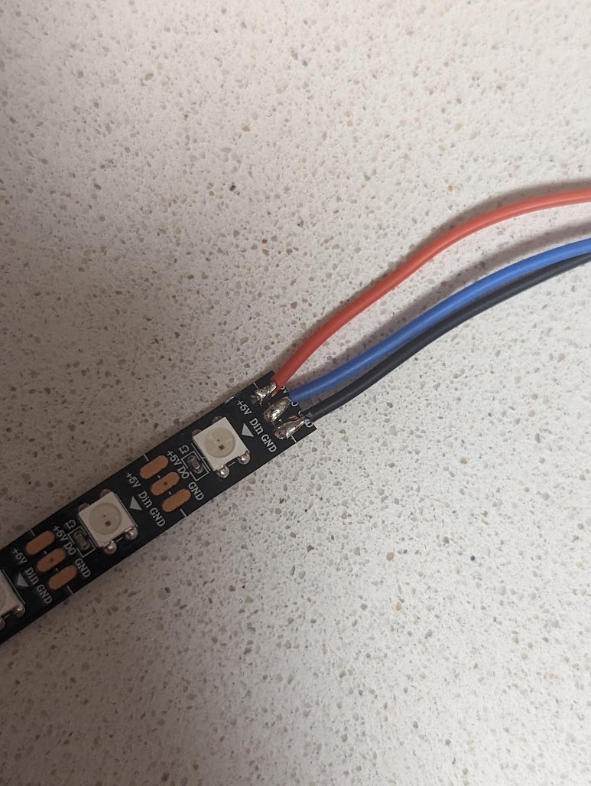
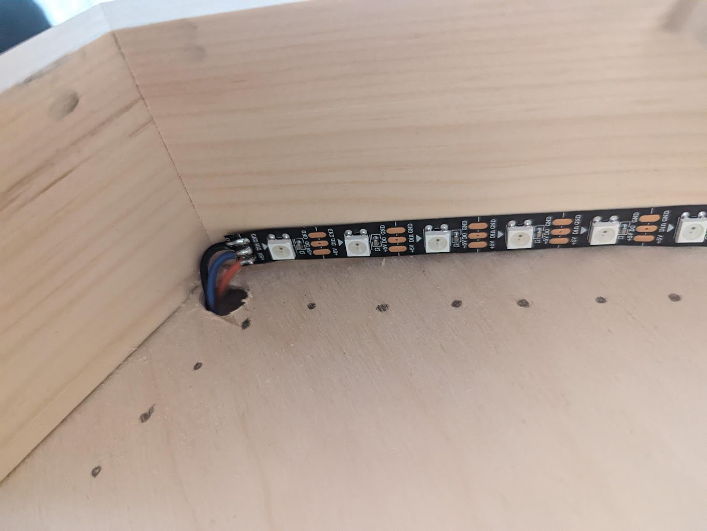
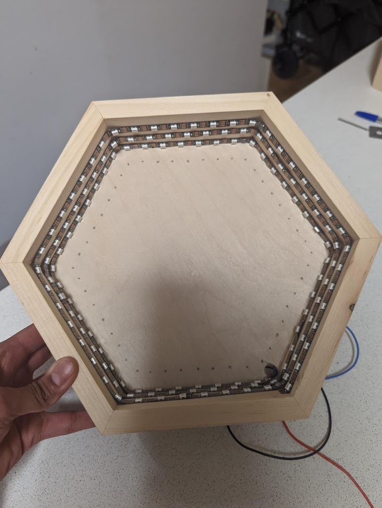
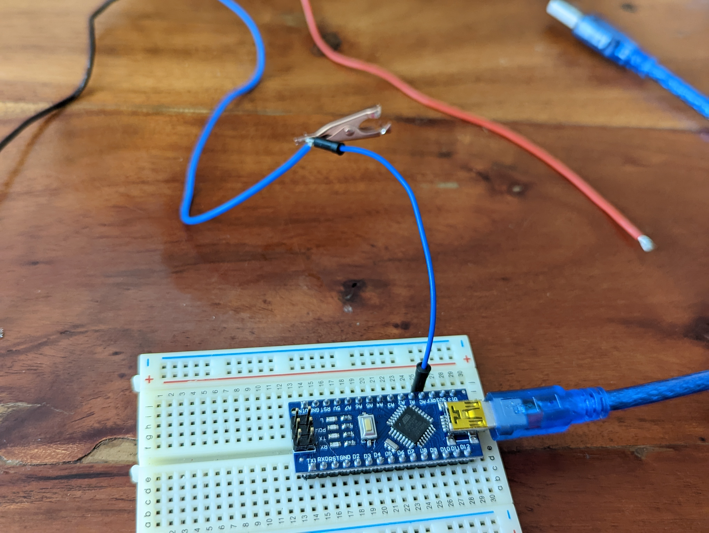
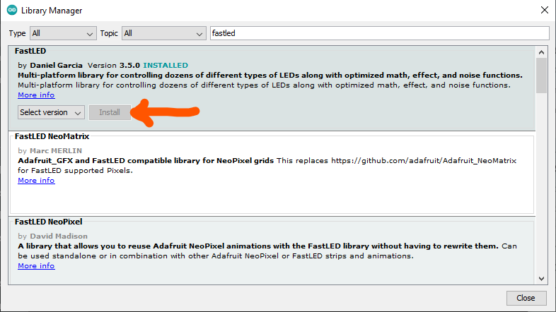
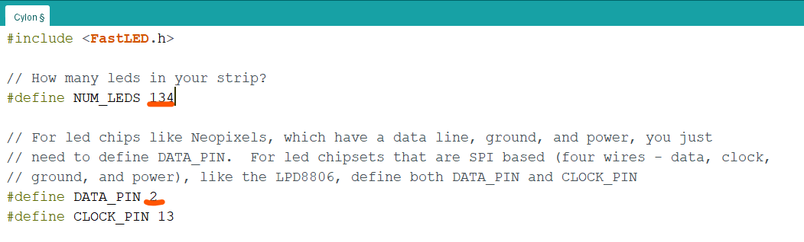
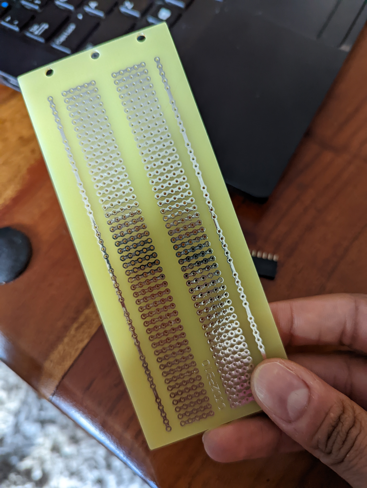
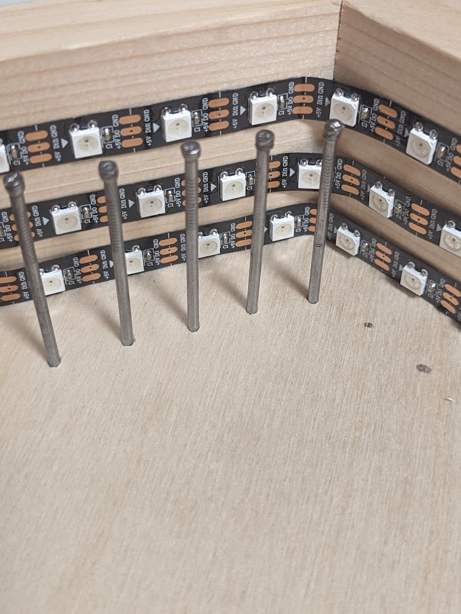
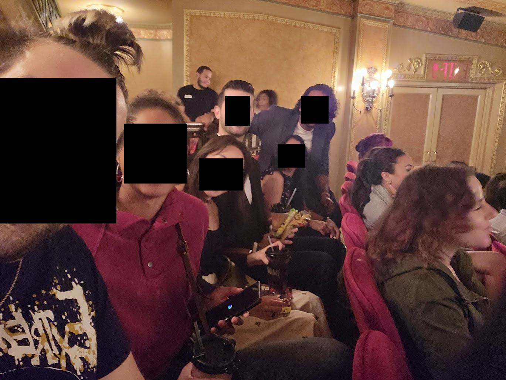

# HAPPY BIRTHDAY ✌️!!!!

Kayla and I have prepared for you a kit to build a cool piece of ELECTRONIC ART!!! Now you can solder, program, hammer, and string your way to your own unique form of artistic expression! Let's make some art so cool that one older art teacher you had would have his brain wrinkled at the thought!

So the general idea for this is:

- LEDs go in the box
- LEDs connect to the arduino
- String art goes on top of it

We've got some sample code here that will get you off your feet, and some pics with vague suggestions on where to place the LEDs. 

## The LEDs!

You'll need to solder the strips and connect them to your Arduino. That's right, we didn't do _shit_ for you. You can earn your own damned birthday present. This picture shows you what you already probably know, but just look at how good that soldering job is, eh? Try and be at least a tenth as good as that 😏.

Next, use the adhesive to attach them however the hell you want in the box but make sure the wires are coming out the back through the hole YOUR DEAR, DEAR, SELFLESS FRIENDS SO GRACIOUSLY CUT FOR YOU. But we suggest attaching first, and programming later. That way ya get to see how it'd look in real time 😊

Maybe tape them in a circle around the box? Or whatever. Who cares, this is a github repo, not a cop.

## The ARDIUNIO!
### The Wiring

We got you an Arduino Nano! We fucked up a bit cause we got you one that runs at 3.3V instead of 5V BUTTTT we tried it out and it still runs the LEDs just fine, so we are going to pretend like it was built for it :P. If you want to get some extra info on the board, we got you go here: https://docs.arduino.cc/hardware/nano

We provided a nice lil breadboard, some jumper wires, and some lil clippies so you can prototype it before soldering. Push that nano down on the breadboard, put a jumper wire in the 3.3V, one in the GND, and one on Pin 2 (we preprogrammed some shiz for you that instructions below will show you how to modify). Here's how we envisioned you prototying with the clippies/jumpers/bread...

Once you have it hooked up plug in that Duino of the Arrrrr and you should see some B-E-A-U-TIFUL colors blaring from your art. If not...double check your wiring --> send a message to the great beyond --> ask for forgiveness for all prior sins --> then see if it works...

### The Code

Ok...now let's PLAY WITH THAT CODEEEEE! You'll need to first install the Arduino IDE by going here: https://www.arduino.cc/en/software#future-version-of-the-arduino-ide  

If you have a windows machine then you'll need to download the driver for the Nano cause we got that cheap shizz from China that used a different chip than our comps are used to recognizing. Here's where you can download it: https://www.wch.cn/download/CH341SER_EXE.html 

Definitely looks sketch, mostly cause you wont be able to understand any of it, but we tried it out and it works great. We got the instructions from this instructable: https://www.instructables.com/Arduino-Nano-USB-Not-Recognizing-Fix/ if you're still sketched out by it, you can also program it at our place or just use the starter code that we already programmed on it! 

Install FastLED Library: 

    Open Arduino software and then go to "Tools" --> "Manage Libraries"
    Type in the search bar "fastled"  and then click "Install"

Once you have the Arduino IDE installed and the driver to access the nano installed, you can program it. To do this you'll want to do the following: 

- Plug in the Arduino 
- Open the IDE and click on "Tools" --> "Board" --> select Arduino Nano from the drop down
- Select the Port that the microcontroller is hooked up to "Tools" --> "Port" --> "COM9" 
- - (yours will be a diff number but whatever port appears/disappears as you plug and unplug the arduino is the one to choose) 
- Open one of the examples that downloaded with the library by going to "File" --> "Examples" -->  "FastLED" --> Choose one :D...
- - Cyclon is a good starter one
- In the code you'll want to make sure you select/set the right pin number.
- - i.e. the one that you hook the data pin of the LEDs up to. 
- - You have to choose a PWM pin --> pulse width modulated signal pin which can send the square wave needed to run the LED strip. 
- - Pin 2 is one of these pins but you can also check the documentation in the link above to see which other pins work if you wanna change it for whatever reason...be BOLD...be DEVIANT...be whatever u want really...BUT GET YO PINS RIGHT! 
- - (We already programmed the chip with some code using Pin 2 as the data pin, so if you actually followed the directions above when you plugged the Arduino into power you shoulda seen that shit running like a well oiled bookcase on his way to see his gurrrrl)
- The second thing you need to set in the code is the number of LEDs we had 134 in ours so you can try this to start and modify (or you could guess another number or just count haha). 

Then you'll be set to download the code!  

The two buttons are the check mark button (compiles the code) and the right arrow button (compiles then downloads the code). You can just use the right arrow button cause it'll compile then download...but if you use the check mark button it will not download the code; it'll just check if it can compile it. 
- The ColorPalette example is also super dope :D...this might be what's on there already...i forget lol...
- You might also check out the FastLED Library documentation on GitHub: 
- - https://github.com/FastLED/FastLED/wiki/Basic-usage

## Solder the Arduino!

So if you wanna do this right and you wanna go hard then you gotta make it permanent...or at least partially. We got you a lil PCB that you might cut down to be a bit smaller, and we snapped you off some pin headers. We gave you pin headers in case you didn't wanna solder the Arduino directly onto the board, but you could always just solder that shit downnnnn! Once you figure out what you wanna do with the Arduino mounting, solder those three wires into the GND, Vcc/3.3V, and data pin that you've chosen. 

Once everything is soldered, you can use some hot glue to stick it to the back of your hex thanggg. What we forgot to get you is a longer power cord so that you can just plug this shit into the wall. You can use any USB-B Mini chord and a wall wart to plug it in. Just a caution, if you get a cord without data then you won't be able to use that cord for programming, but you will be able to use it for powering it! 

## The NAILS

Kayla literally told me just now "make sure you put in there that when she hammers the nails she has to make sure the nails don't move." So, when you nail them make sure they don't move. Got it? Great. Kayla def had to go around and hammer some shit as she was wrapping the string so it's cool if you need to do this. The board shouldn't split in the front even though you'll see it starting to split in the back (which is fine)...yay cheap plywood!!! 

Here is a picture of one of the many ways Kayla experimented with this. Idk if she suggests this method but whatever

Once it's nailed properly, tie it up!

## String it UP

There's a LOT of inspiration you can take for string art. Like, take a look at some of these fuckers:

https://youtu.be/28c3dlF54yE

https://youtu.be/5gbwxqFnWek

https://youtu.be/sfXcEXDesHM

Or, you could just take the search term "string nail art circle" and search yourself. It's not rocket science. BUT, if you fuck this up and it looks bad we'll forever judge your for your ineptitude. 

## Put it somewhere

Now that's done, put it somewhere! If you're proud of it, put it somewhere others can see it! If you aren't pretend like you are forever working on your unfinished masterpiece and hide it somewhere in shame. Follow your own artistic process!

We hope you had as much fun making this as Kayla did. And, of course, as I did helping Kayla. Here's a picture of us having fun together but our faces are censored since this is a public git repo 🥰

